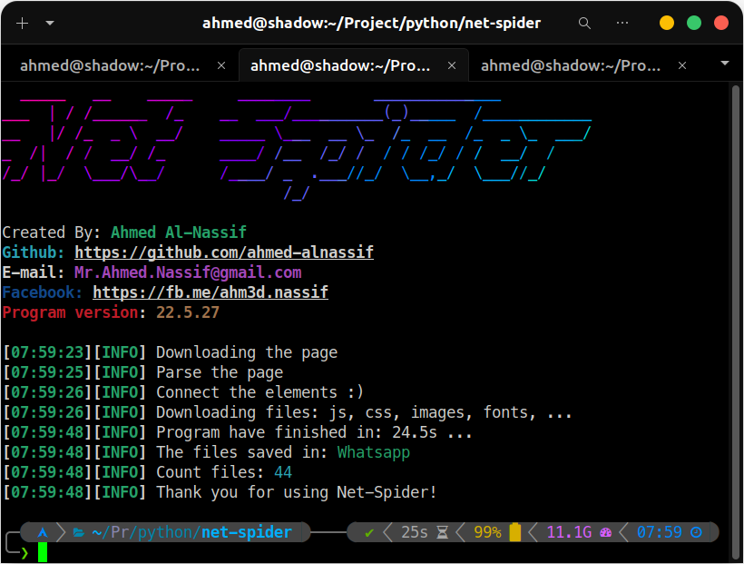
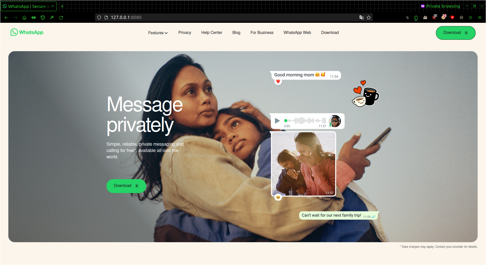

# Net-Spdier
This tool pulls the source code of the <b>html</b> page and the content inside it such as external files: <b>javascript</b>, <b>css</b>, images, fonts, ...<br/>
Also analyze what's inside <b>css</b> files and pull out external links. <br/>
This tool is designed to help you learn and develop quickly by understanding the code written by large companies This tool only pulls <b>Front-End</b> codes
<center>

</center>

# Installation
Packages needed for installation
```
apt update
apt install git python -y
```
Installation
```
git clone https://github.com/ahmed-alnassif/net-spider.git
```
Installation packages python
```
cd net-spider
python -m pip install -r requirements.txt
# OR
python setup.py install
```
Run
```
python main.py
```

# Usage
```
python main.py --help
```
```
_____   __    _____     ________       ______________
___  | / /______  /_    __  ___/__________(_)_____  /____________
__   |/ /_  _ \  __/    _____ \___  __ \_  /_  __  /_  _ \_  ___/
_  /|  / /  __/ /_      ____/ /__  /_/ /  / / /_/ / /  __/  /
/_/ |_/  \___/\__/      /____/ _  .___//_/  \__,_/  \___//_/
                               /_/

Created By: Ahmed Al-Nassif
Github: https://github.com/ahmed-alnassif
E-mail: Mr.Ahmed.Nassif@gmail.com
Facebook: https://fb.me/100049582051187
Porgram version: 1.0

usage: python main.py -u [url]
This project is designed to get the source code for a page Web example front-end: javascript, css, images, fonts ...                  
Net-Spider:
  --help            Show usage and help parameters
  -u                Target url (e.g. http://exmple.com)
  -j, --justdomain  Pull links from primary website address only
  --name NAME       The name of the folder in which to save the site files
  --hide            Hidden proggress bar [----]
  -v                Give more output.
  --page RAW        html file to parse and get all files from it
  --update          Automatically update the tool

Settings requests:
  --cookie          Set cookie (e.g {"ID": "1094200543"})
  --header          Set header (e.g {"User-Agent": "Chrome Browser"})
  --proxy PROXY     Set proxy (e.g. {"https":"https://10.10.1.10:1080"})
```

# Screenshots
<center>
<pre>



</pre>
</center>